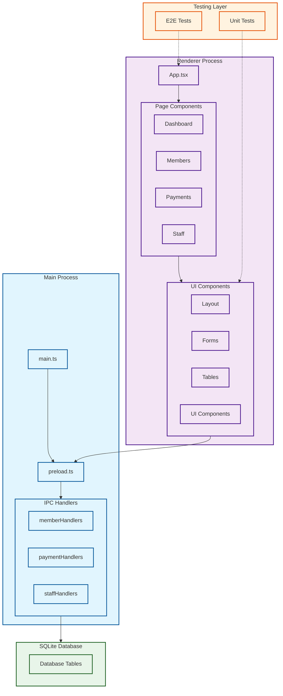
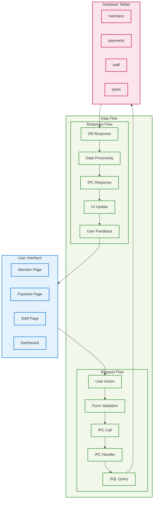
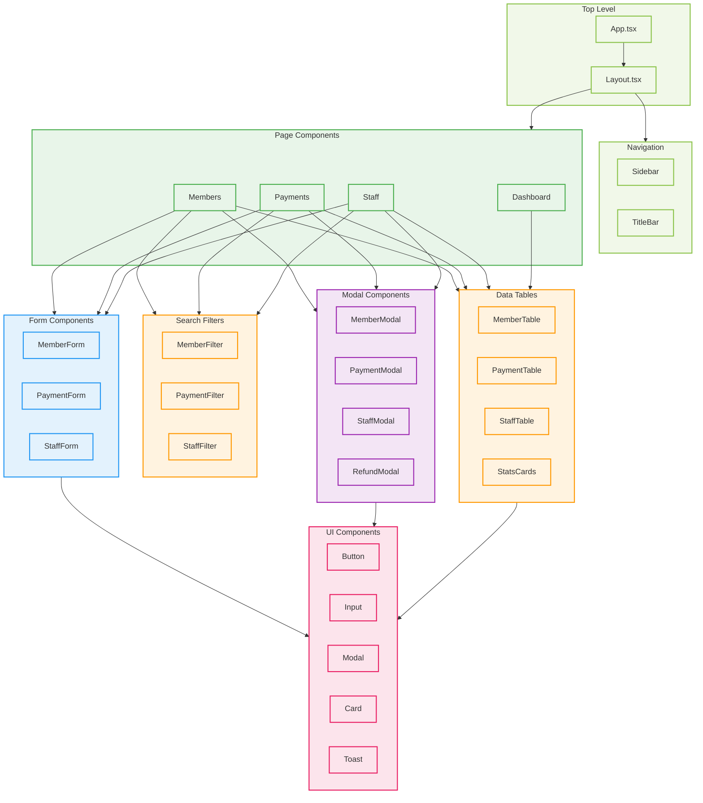
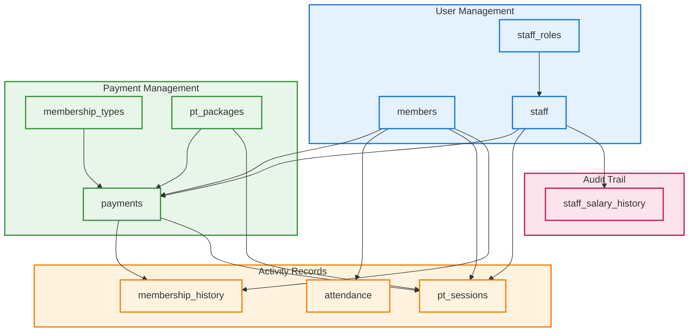

# 🏗️ Awarefit CRM 프로젝트 전체 아키텍처 가이드

## 📋 개요

이 문서는 Awarefit CRM 시스템의 전체 아키텍처를 체계적으로 설명하고, 시스템
구조와 데이터 흐름을 시각화한 종합 가이드입니다. 개발팀이 프로젝트의 전체 구조를
이해하고 효율적으로 개발할 수 있도록 작성되었습니다.

**마지막 업데이트**: 2025-08-01

---

## 🎯 프로젝트 기본 정보

### 📊 **기술 스택**

- **프레임워크**: Electron + React + TypeScript
- **스타일링**: Tailwind CSS
- **데이터베이스**: SQLite (better-sqlite3)
- **테스트**: Jest (단위) + Playwright (E2E)
- **빌드 도구**: Webpack
- **코드 품질**: ESLint + TypeScript

### 🏢 **도메인 영역**

- 👥 **회원 관리**: 개인정보, 회원권, 출석 관리
- 💳 **결제 관리**: 결제 처리, 환불, 통계
- 👨‍💼 **직원 관리**: 직원 정보, 권한, 급여 관리
- 📊 **대시보드**: 통계, 현황, 퀵 액션

---

## 🏗️ 1. 전체 시스템 아키텍처



### 🔑 **아키텍처 핵심 특징**

1. **🔒 보안성**: Electron의 Context Isolation으로 안전한 IPC 통신
2. **📈 확장성**: 모듈화된 IPC 핸들러와 컴포넌트 구조
3. **🧪 테스트 가능성**: E2E와 Unit 테스트로 전체 스택 커버리지
4. **⚡ 성능**: SQLite 최적화와 React 컴포넌트 재사용
5. **🎨 사용자 경험**: 일관된 UI 시스템과 실시간 피드백

---

## 🔄 2. 데이터 흐름 아키텍처



### 📊 **데이터 흐름 단계별 설명**

#### 📤 **요청 단계 (User → Database)**

1. **사용자 액션**: 버튼 클릭, 폼 제출, 검색 등
2. **React Form 검증**: 클라이언트 사이드 유효성 검사
3. **IPC 호출**: `window.electronAPI`를 통한 메인 프로세스 호출
4. **IPC Handler**: 비즈니스 로직 처리 및 권한 검증
5. **SQL 쿼리**: 안전한 파라미터 바인딩으로 데이터베이스 조작

#### 📥 **응답 단계 (Database → User)**

1. **데이터베이스 응답**: SQLite에서 결과 반환
2. **데이터 처리**: 결과 변환, 계산, 검증
3. **IPC 응답**: 렌더러 프로세스로 결과 전송
4. **UI 업데이트**: React 상태 업데이트 및 리렌더링
5. **사용자 피드백**: Toast 알림으로 성공/실패 메시지

---

## 🎨 3. React 컴포넌트 아키텍처



### 🧱 **컴포넌트 설계 원칙**

#### 📋 **페이지 레벨 컴포넌트**

- **단일 책임**: 각 페이지는 하나의 도메인 영역만 담당
- **상태 관리**: 페이지별 로컬 상태와 전역 상태 분리
- **라우팅**: React Router를 통한 선언적 라우팅

#### 🧩 **기능별 컴포넌트**

- **폼 컴포넌트**: 검증 로직과 제출 처리 분리
- **테이블 컴포넌트**: 정렬, 필터링, 페이지네이션 내장
- **모달 컴포넌트**: 재사용 가능한 팝업 인터페이스

#### 🎛️ **공통 UI 컴포넌트**

- **일관성**: 디자인 시스템 기반 통일된 스타일
- **접근성**: ARIA 레이블과 키보드 네비게이션 지원
- **반응형**: 다양한 화면 크기 대응

---

## 💾 4. 데이터베이스 스키마 아키텍처



### 🗄️ **데이터베이스 설계 원칙**

#### 👥 **사용자 관리 테이블**

- **members**: 회원 기본 정보, 연락처, 활성 상태
- **staff**: 직원 정보, 권한, 급여 데이터
- **staff_roles**: 역할 기반 권한 관리

#### 💳 **결제 관리 테이블**

- **payments**: 모든 결제 내역과 상태 추적
- **membership_types**: 회원권 종류와 가격 정책
- **pt_packages**: PT 패키지 정의

#### 📊 **활동 기록 테이블**

- **attendance**: 출입 기록과 시간 추적
- **pt_sessions**: PT 세션 예약 및 완료 기록
- **membership_history**: 회원권 이용 이력

#### 🔍 **감사 추적 테이블**

- **staff_salary_history**: 급여 변경 이력과 승인 기록

---

## 🧪 5. 테스트 아키텍처

### 🎭 **E2E 테스트 (Playwright)**

```typescript
// 테스트 구조
e2e/
├── navigation.spec.ts        # 페이지 이동, 메뉴 테스트
├── ui-elements.spec.ts       # 폼, 모달, 버튼 등 UI 테스트
├── api-error-handling.spec.ts # API 오류 및 환경 감지 테스트
├── performance.spec.ts       # 성능, 접근성 테스트
├── payment-edit-bug.spec.ts  # 결제 편집 버그 회귀 테스트
├── component-demo.spec.ts    # 컴포넌트 데모 페이지 테스트
├── global-setup.ts          # 테스트 환경 설정
└── global-teardown.ts       # 테스트 정리
```

#### 📊 **테스트 범위**

- **네비게이션**: 페이지 이동, URL 라우팅, 메뉴 작동
- **UI 요소**: 폼 입력, 버튼 클릭, 모달 상호작용
- **API 오류**: 환경 감지, 오류 처리, 복구 로직
- **성능**: 로드 시간, 메모리 사용, 접근성 점검

### 🔬 **Unit 테스트 (Jest)**

```typescript
// 테스트 구조
src/__tests__/
├── components/              # 컴포넌트 테스트
├── services/               # 서비스 레이어 테스트
├── utils/                  # 유틸리티 함수 테스트
├── integration/            # 통합 테스트
└── setup.ts               # 테스트 설정
```

#### 🧪 **테스트 유형**

- **컴포넌트**: 렌더링, Props, 이벤트 핸들링
- **유틸리티**: 비즈니스 로직, 데이터 변환, 계산
- **서비스**: API 호출, 데이터 처리, 오류 시나리오

---

## 🔧 6. 개발 도구 및 워크플로우

### 🛠️ **개발 도구 스택**

| 도구             | 용도              | 설정 파일              |
| ---------------- | ----------------- | ---------------------- |
| **Webpack**      | 번들링, 핫 리로드 | `webpack.config.js`    |
| **TypeScript**   | 타입 검사, 컴파일 | `tsconfig.json`        |
| **Tailwind CSS** | 유틸리티 스타일링 | `tailwind.config.js`   |
| **ESLint**       | 코드 품질 관리    | `.eslintrc.js`         |
| **Playwright**   | E2E 테스트        | `playwright.config.ts` |
| **Jest**         | 단위 테스트       | `jest.config.js`       |

### 🔄 **개발 워크플로우**

#### 📋 **새 기능 개발 순서**

1. **기능 설계** 및 타입 정의 (`src/types/`)
2. **TypeScript 타입 체크** 통과 확인 (`npm run type-check`)
3. **컴포넌트 개발** UI 우선 접근
4. **ESLint 검사** 통과 확인 (`npm run lint`)
5. **API 연동** IPC 핸들러 개발
6. **E2E 테스트 작성** ← **필수!**
7. **최종 검증** 및 디버깅
8. **커밋 및 푸시**

#### 🐛 **버그 수정 순서**

1. **버그 재현** 단계 확인
2. **실패하는 테스트** 먼저 작성
3. **버그 수정** 구현
4. **TypeScript/ESLint** 체크
5. **테스트 통과** 확인
6. **회귀 테스트** 추가

---

## 📁 7. 프로젝트 구조 상세

### 🗂️ **디렉토리 구조**

```
src/
├── 📁 main/                    # ⚡ Electron Main Process
│   ├── main.ts                 # 메인 프로세스 진입점
│   ├── preload.ts              # Preload 스크립트
│   ├── ipc/                    # IPC 핸들러
│   │   ├── memberHandlers.ts   # 회원 관리 API
│   │   ├── paymentHandlers.ts  # 결제 관리 API
│   │   ├── staffHandlers.ts    # 직원 관리 API
│   │   └── systemHandlers.ts   # 시스템 API
│   └── services/               # 메인 프로세스 서비스
│       ├── databaseService.ts  # 데이터베이스 서비스
│       └── fileService.ts      # 파일 시스템 서비스
├── 📁 renderer/                # 🎨 Renderer Process
│   ├── App.tsx                 # 메인 앱 컴포넌트
│   ├── index.tsx               # React 진입점
│   ├── index.html              # HTML 템플릿
│   └── index.css               # 글로벌 스타일
├── 📁 pages/                   # 📄 페이지 컴포넌트
│   ├── Dashboard.tsx           # 대시보드
│   ├── Members.tsx             # 회원 관리
│   ├── Payments.tsx            # 결제 관리
│   ├── Staff.tsx               # 직원 관리
│   └── ComponentDemo.tsx       # 컴포넌트 데모
├── 📁 components/              # 🧱 React 컴포넌트
│   ├── layout/                 # 레이아웃 컴포넌트
│   ├── member/                 # 회원 관련 컴포넌트
│   ├── payment/                # 결제 관련 컴포넌트
│   ├── staff/                  # 직원 관련 컴포넌트
│   ├── ui/                     # 공통 UI 컴포넌트
│   └── common/                 # 공통 컴포넌트
├── 📁 types/                   # 🏷️ TypeScript 타입 정의
│   ├── member.ts               # 회원 타입
│   ├── payment.ts              # 결제 타입
│   ├── staff.ts                # 직원 타입
│   └── common.ts               # 공통 타입
├── 📁 database/                # 💾 데이터베이스
│   ├── init.ts                 # 데이터베이스 초기화
│   ├── migrations/             # 스키마 마이그레이션
│   ├── models/                 # 데이터 모델
│   └── repositories/           # 데이터 접근 계층
├── 📁 utils/                   # 🔧 유틸리티 함수
│   ├── memberUtils.ts          # 회원 관련 유틸
│   ├── queryBuilder.ts         # 쿼리 빌더
│   ├── dbLogger.ts             # 데이터베이스 로거
│   └── errorDetector.ts        # 오류 감지기
└── 📁 __tests__/               # 🧪 테스트 파일
    ├── components/             # 컴포넌트 테스트
    ├── services/               # 서비스 테스트
    ├── utils/                  # 유틸리티 테스트
    └── integration/            # 통합 테스트
```

---

## 🚀 8. 핵심 API 레퍼런스

### 📡 **IPC API 구조**

#### 👥 **회원 관리 API**

```typescript
window.electronAPI.database.member = {
  getAll: (filter?: MemberSearchFilter) => Promise<Member[]>,
  getById: (id: number) => Promise<Member>,
  getDetail: (id: number) => Promise<MemberDetail>,
  create: (data: CreateMemberInput) => Promise<Member>,
  update: (id: number, data: UpdateMemberInput) => Promise<Member>,
  delete: (id: number) => Promise<void>,
  search: (query: string) => Promise<Member[]>,
  getStats: () => Promise<MemberStats>,
  bulkAction: (action: string, memberIds: number[]) => Promise<void>,
};
```

#### 💳 **결제 관리 API**

```typescript
window.electronAPI.database.payment = {
  getAll: (filter?: PaymentSearchFilter) => Promise<Payment[]>,
  getById: (id: number) => Promise<PaymentDetail>,
  create: (data: CreatePaymentInput) => Promise<Payment>,
  update: (id: number, data: UpdatePaymentInput) => Promise<Payment>,
  cancel: (id: number, staffId: number, reason?: string) => Promise<void>,
  getStats: (dateRange?: DateRange) => Promise<PaymentStats>,
};
```

#### 👨‍💼 **직원 관리 API**

```typescript
window.electronAPI.database.staff = {
  getAll: (filter?: StaffSearchFilter) => Promise<Staff[]>,
  getById: (id: number) => Promise<Staff>,
  create: (data: CreateStaffInput) => Promise<Staff>,
  update: (id: number, data: UpdateStaffInput) => Promise<Staff>,
  delete: (id: number) => Promise<void>,
  salaryAdjust: (data: SalaryAdjustmentInput) => Promise<void>,
  salaryHistory: (staffId: number) => Promise<SalaryHistory[]>,
};
```

---

## ⚡ 9. 성능 최적화 전략

### 🏃‍♂️ **프론트엔드 최적화**

- **React.memo**: 불필요한 리렌더링 방지
- **useMemo/useCallback**: 계산 비용이 높은 연산 캐싱
- **코드 스플리팅**: 페이지별 번들 분할
- **이미지 최적화**: WebP 포맷 사용

### 🗄️ **데이터베이스 최적화**

- **인덱스 최적화**: 자주 검색되는 컬럼 인덱싱
- **쿼리 최적화**: N+1 문제 해결, JOIN 최적화
- **페이지네이션**: 대용량 데이터 처리
- **캐싱 전략**: 자주 조회되는 데이터 메모리 캐싱

### ⚡ **Electron 최적화**

- **프로세스 분리**: CPU 집약적 작업 워커 스레드 처리
- **메모리 관리**: 메모리 누수 방지, 가비지 컬렉션 최적화
- **네이티브 모듈**: 성능이 중요한 부분 네이티브 구현

---

## 🔒 10. 보안 및 데이터 보호

### 🛡️ **Electron 보안**

- **Context Isolation**: 렌더러와 메인 프로세스 격리
- **Node Integration 비활성화**: 보안 위험 최소화
- **CSP 적용**: Content Security Policy 설정
- **Preload 스크립트**: 안전한 API 노출

### 🔐 **데이터 보안**

- **SQL Injection 방지**: 파라미터 바인딩 필수
- **입력 검증**: 클라이언트/서버 이중 검증
- **개인정보 보호**: 민감 정보 암호화
- **접근 권한**: 역할 기반 접근 제어

---

## 📈 11. 모니터링 및 로깅

### 📊 **로깅 시스템**

```typescript
// 로깅 레벨
- ERROR: 시스템 오류, 복구 불가능한 문제
- WARN: 경고, 잠재적 문제
- INFO: 일반 정보, 주요 이벤트
- DEBUG: 디버깅 정보, 개발 단계
```

### 🔍 **모니터링 지표**

- **성능**: 페이지 로드 시간, API 응답 시간
- **오류**: 에러율, 크래시 보고서
- **사용성**: 사용자 행동 패턴, 기능 사용률
- **시스템**: 메모리 사용량, CPU 사용률

---

## 🎯 12. 향후 확장 계획

### 🚀 **단기 로드맵 (1-3개월)**

- **PT 스케줄 관리**: 예약, 취소, 트레이너 배정
- **통계 대시보드**: 상세 분석, 차트 시각화
- **데이터 백업/복원**: 자동 백업 시스템
- **모바일 반응형**: 태블릿 지원

### 🌟 **중기 로드맵 (3-6개월)**

- **알림 시스템**: 결제 만료, 생일 축하 등
- **리포트 생성**: PDF/Excel 내보내기
- **다국어 지원**: i18n 국제화
- **클라우드 동기화**: 데이터 백업 클라우드

### 🎪 **장기 로드맵 (6개월+)**

- **모바일 앱**: React Native 크로스 플랫폼
- **웹 버전**: PWA 웹 애플리케이션
- **API 서버**: RESTful API 제공
- **마이크로서비스**: 도메인별 서비스 분리

---

## 📚 13. 참고 문서

### 📖 **기술 문서**

- [Electron 공식 문서](https://www.electronjs.org/docs)
- [React 공식 문서](https://react.dev)
- [TypeScript 핸드북](https://www.typescriptlang.org/docs)
- [Tailwind CSS 문서](https://tailwindcss.com/docs)

### 🧪 **테스트 가이드**

- [Playwright 문서](https://playwright.dev)
- [Jest 문서](https://jestjs.io/docs)
- [Testing Library](https://testing-library.com/docs)

### 🔧 **개발 도구**

- [Webpack 가이드](https://webpack.js.org/guides)
- [ESLint 규칙](https://eslint.org/docs/rules)
- [Prettier 설정](https://prettier.io/docs)

---

## 👥 14. 기여 가이드

### 🤝 **개발 참여**

1. **이슈 확인**: GitHub Issues에서 작업할 이슈 선택
2. **브랜치 생성**: `feature/기능명` 또는 `fix/버그명`
3. **개발 진행**: 가이드라인에 따라 개발
4. **테스트 작성**: E2E 테스트 필수 작성
5. **PR 생성**: 상세한 설명과 함께 Pull Request

### 📝 **커밋 규칙**

```bash
✨ feat: 새로운 기능 추가
🐛 fix: 버그 수정
📚 docs: 문서 업데이트
🎨 style: 코드 스타일 변경
♻️ refactor: 코드 리팩토링
🧪 test: 테스트 추가/수정
🔧 chore: 빌드/설정 변경
```

---

## 📞 14. 지원 및 문의

### 🆘 **문제 해결**

- **GitHub Issues**: 버그 리포트, 기능 요청
- **Discussion**: 질문, 아이디어 공유
- **Wiki**: 상세 가이드, FAQ

### 📧 **연락처**

- **프로젝트 관리자**: [이메일 주소]
- **기술 지원**: [Slack/Discord 채널]
- **문서 피드백**: [문서 이슈 페이지]

---

**마지막 업데이트**: 2025-08-01  
**문서 버전**: v1.0.0  
**다음 리뷰 예정**: 2025-08-15
